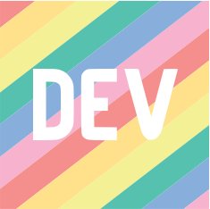
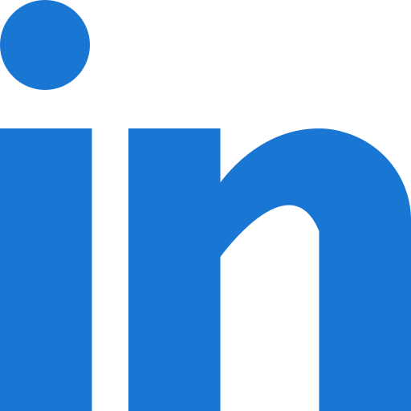

<h1 align="center">Hi 👋, I'm Nirav Kanani</h1>
<h3 align="center">Professional Ruby On Rails Developer</h3>
<h4 align="center">Software Engineer 💻 Passionate about continuous growth and development.</h4>

  

- 🌱 I’m currently learning React JS and AWS Cloud

- 👨‍💻 All of my projects are available at [https://github.com/kananinirav](https://github.com/kananinirav)

- 📝 I regularly write articles on [https://medium.com/@kanani-nirav](https://medium.com/@kanani-nirav)

- 📫 How to reach me **kananinirav0@gmail.com**

## 📚 Blogs Post
<!-- BLOG-POST-LIST:START -->
- [GitLab Dev Deletes Entire Production Database](https://medium.com/@kanani-nirav/gitlab-dev-deletes-entire-production-database-719756f4a2ce?source=rss-9ad7dce5400b------2)
- [ChatGPT Prompts: A Guide for Developers ‍](https://medium.com/@kanani-nirav/chatgpt-prompts-a-guide-for-developers-367178e83573?source=rss-9ad7dce5400b------2)
- [Secret To Optimizing SQL Queries — Understand The SQL Execution Order](https://medium.com/@kanani-nirav/secret-to-optimizing-sql-queries-understand-the-sql-execution-order-afda6788e537?source=rss-9ad7dce5400b------2)
- [Git Cheat Sheet: Essential Commands for Effective Code Management](https://blog.devgenius.io/git-cheat-sheet-essential-commands-for-effective-code-management-82ce06f3e70b?source=rss-9ad7dce5400b------2)
- [How to Monitor and Alert Docker Container Status on EC2 for High Availability](https://medium.com/cloud-native-daily/how-to-monitor-and-alert-docker-container-status-on-ec2-for-high-availability-475b0b65e04?source=rss-9ad7dce5400b------2)
- [The Five Lines of Code Principle: Why Less is More in Programming](https://medium.com/@kanani-nirav/the-five-lines-of-code-principle-why-less-is-more-in-programming-12ff4446205?source=rss-9ad7dce5400b------2)
- [Getting Started with GitHub Actions: A Beginner’s Guide](https://blog.devgenius.io/getting-started-with-github-actions-a-beginners-guide-81629c543798?source=rss-9ad7dce5400b------2)
- [Git Rebase vs Git Merge, Which One is the Best Option?](https://blog.devgenius.io/git-rebase-vs-git-merge-which-one-is-the-best-option-b61a4b389f5d?source=rss-9ad7dce5400b------2)
- [35 Windows Commands you NEED to know with examples and explanation](https://medium.com/@kanani-nirav/35-windows-commands-you-need-to-know-with-examples-and-explanation-d4bedb3c3508?source=rss-9ad7dce5400b------2)
- [50 Linux Commands every developer NEED to know with example](https://blog.devgenius.io/50-linux-commands-every-developer-need-to-know-with-example-891828f1b0d0?source=rss-9ad7dce5400b------2)
<!-- BLOG-POST-LIST:END -->

<h3 align="left">Connect with me:</h3>

## ✨GitHub Stats  : 

  
  

 

#### If you find the content is interesting and helpful, use the “Buy me a Coffee” link below to buy me a coffee.

